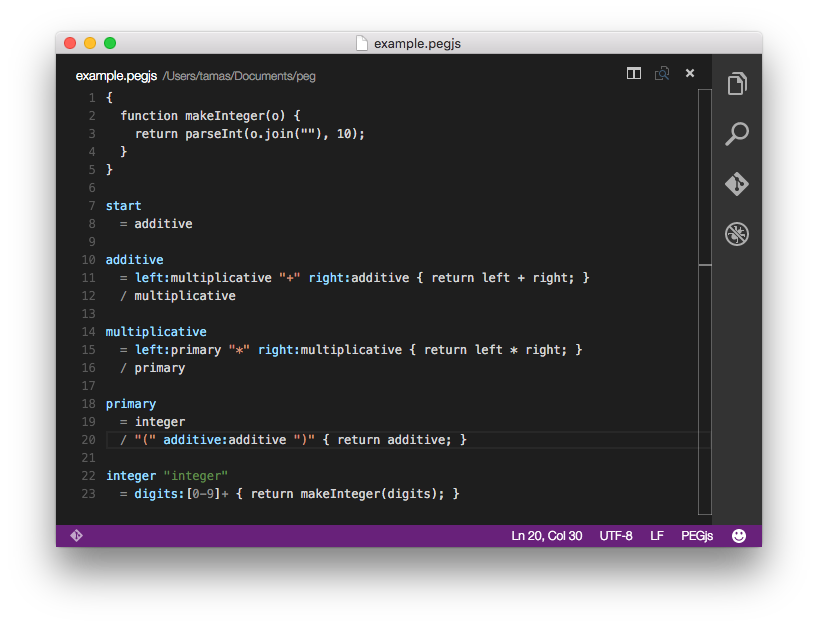

# PEG.js Syntax Highlighting for Visual Studio Code

Based on Alexandre Lacheze’s [PEGjs.tmbundle](https://github.com/alexstrat/PEGjs.tmbundle).

## Installation

1. Check out the git repository.
2. Copy the pegjs folder into your Visual Studio Code extensions folder:
    * **Windows** `%USERPROFILE%\.vscode\extensions`
    * **OS X & Linux** `$HOME/.vscode/extensions` 

e.g. on OS X and Linux:

    $ git checkout https://github.com/drjokepu/pegjs-vscode.git
    $ cp -r pegjs-vscode/pegjs ~/.vscode/extensions